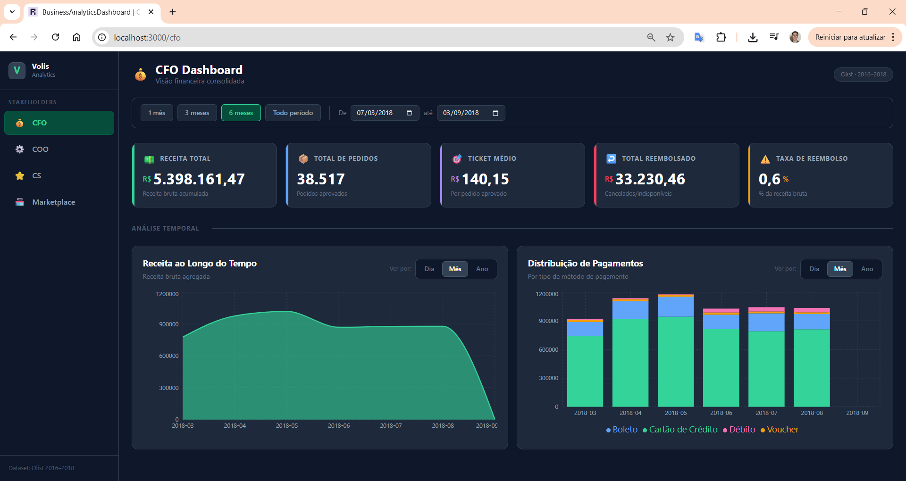
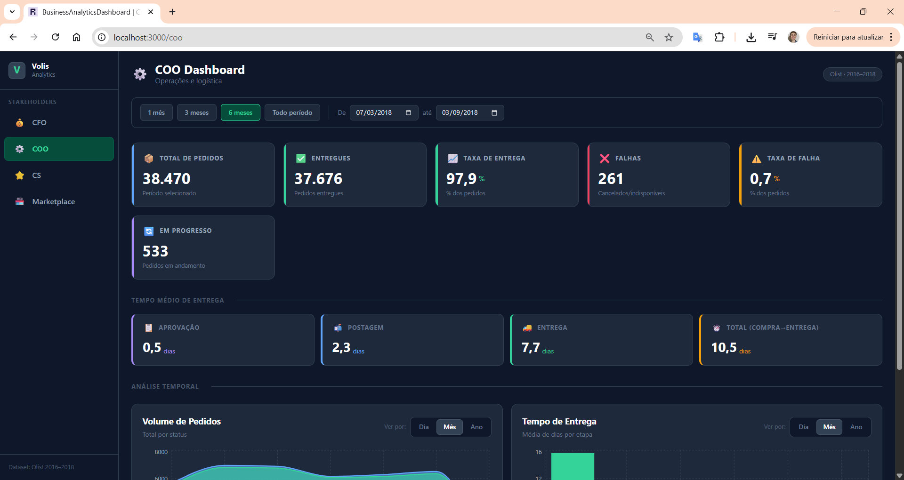
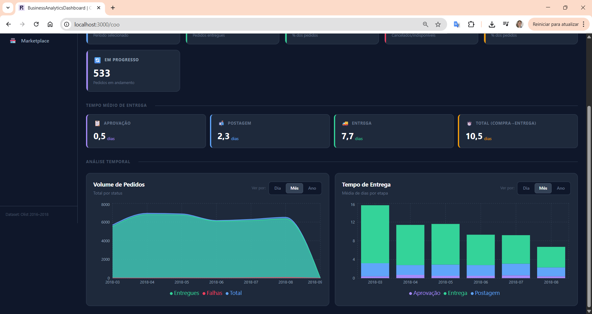
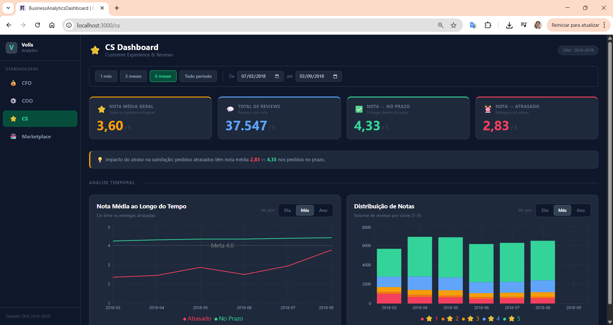
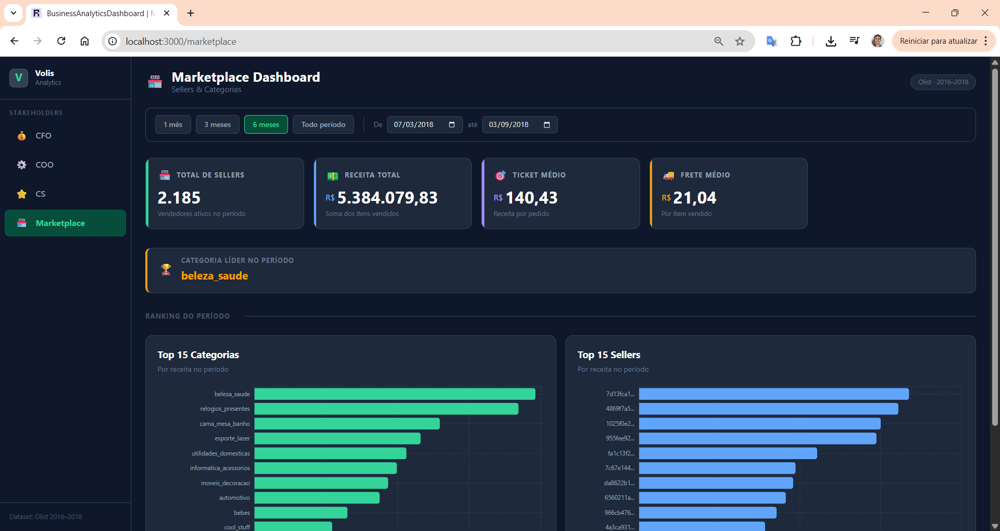

# Volis — C-Level Analytics Dashboard

> A full-stack data analytics project built with **dbt + DuckDB + Reflex**, delivering a real-time executive dashboard for a Brazilian e-commerce platform (Olist dataset).

---

## Screenshots

### 💰 CFO Dashboard


### ⚙️ COO Dashboard



### ⭐ CS Dashboard


### 🏪 Marketplace Dashboard


---

## Table of Contents

- [Overview](#overview)
- [Tech Stack](#tech-stack)
- [Project Structure](#project-structure)
- [How to Run Locally](#how-to-run-locally)
- [Functional Requirements Document (FRD)](#functional-requirements-document-frd)
  - [The Goal](#the-goal)
  - [Key Metrics](#key-metrics)
  - [Actions & Business Value](#actions--business-value)
  - [Data Sources](#data-sources)
  - [Next Steps](#next-steps)

---

## Overview

Volis is a C-Level executive dashboard that transforms raw e-commerce data into actionable business intelligence. It is structured around four core stakeholders — **CFO, COO, Head of CS, and Head of Marketplace** — each with a dedicated page tailored to their decision-making needs.

The data pipeline follows a three-layer dbt architecture (`intermediate → marts → summary`), with DuckDB as the local warehouse and Reflex rendering the UI entirely in Python.

---

## Tech Stack

| Layer | Tool | Purpose |
|---|---|---|
| Data Warehouse | DuckDB | Local SQL engine, zero-config |
| Transformation | dbt-core | Data modeling, lineage, documentation |
| UI Framework | Reflex | Python-native full-stack web app |
| Data Source | Olist (Kaggle) | Brazilian e-commerce dataset (2016–2018) |

---

## Project Structure

```
volis-case/
├── volis_analytics/               # dbt project
│   ├── seeds/                     # Raw Olist CSV files
│   ├── models/
│   │   ├── intermediate/          # Cleaned, typed base models
│   │   │   ├── int_orders.sql
│   │   │   ├── int_order_items.sql
│   │   │   ├── int_payments.sql
│   │   │   └── int_reviews.sql
│   │   └── marts/
│   │       ├── finance/
│   │       │   ├── mart_financials.sql
│   │       │   ├── mart_payment_distribution.sql
│   │       │   └── summary_cfo.sql
│   │       ├── operations/
│   │       │   ├── mart_orders.sql
│   │       │   └── summary_coo.sql
│   │       ├── customer/
│   │       │   ├── mart_reviews.sql
│   │       │   ├── mart_reviews_vs_delivery.sql
│   │       │   ├── mart_reviews_distribution.sql
│   │       │   ├── mart_reviews_summary.sql
│   │       │   └── summary_cs.sql
│   │       └── marketplace/
│   │           ├── mart_sellers.sql
│   │           ├── mart_categories.sql
│   │           └── summary_marketplace.sql
│   ├── dbt_project.yml
│   └── dev.duckdb                 # Local DuckDB database (generated)
│
└── business_analytics_dashboard/  # Reflex app
    ├── pages/
    │   ├── cfo_page.py
    │   ├── coo_page.py
    │   ├── cs_page.py
    │   └── marketplace_page.py
    ├── components/
    │   ├── sidebar.py
    │   ├── kpi_card.py
    │   ├── date_filter.py
    │   ├── granularity_toggle.py
    │   ├── cfo_charts.py
    │   ├── coo_charts.py
    │   ├── cs_charts.py
    │   └── marketplace_charts.py
    ├── states/
    │   └── dashboard_state.py
    └── business_analytics_dashboard.py
```

---

## How to Run Locally

### Prerequisites

- Python 3.11+
- Node.js 18+ (required by Reflex)
- Git

### 1. Clone the repository

```bash
git clone https://github.com/<your-username>/volis-case.git
cd volis-case
```

### 2. Create and activate a virtual environment

```bash
python -m venv venv

# Windows
venv\Scripts\activate

# macOS / Linux
source venv/bin/activate
```

### 3. Install dependencies

```bash
pip install dbt-duckdb reflex duckdb
```

### 4. Build the dbt models

```bash
cd volis_analytics
dbt seed          # loads raw CSVs into DuckDB
dbt run           # builds all intermediate + mart models
cd ..
```

> This generates `volis_analytics/dev.duckdb` with all tables ready.

### 5. Run the Reflex dashboard

```bash
cd business_analytics_dashboard
reflex run
```

Open [http://localhost:3000](http://localhost:3000) in your browser.

---

## Functional Requirements Document (FRD)

### The Goal

The Volis C-Level Dashboard exists to give senior executives a **single source of truth** for the company's operational, financial, and customer health — without needing to run SQL queries or wait for weekly reports.

The dashboard is designed to answer the question: *"Is the business healthy right now, and where should we focus our attention?"*

---

### Key Metrics

#### 💰 CFO — Financial Health

| Metric | Definition | Why it matters |
|---|---|---|
| Total Revenue | Sum of gross order value in the period | Top-line business health |
| Total Orders | Count of approved orders | Volume indicator |
| Average Ticket | Revenue ÷ Orders | Pricing and mix signal |
| Total Refunded | Sum of canceled/unavailable order value | Revenue leakage |
| Refund Rate | Refunded ÷ Gross Revenue | Risk and quality signal |
| Revenue over time | Daily/monthly/yearly trend | Seasonality and growth |
| Payment distribution | Volume by payment method | Consumer behavior insight |

#### ⚙️ COO — Operational Efficiency

| Metric | Definition | Why it matters |
|---|---|---|
| Total Orders | Orders in the period | Volume baseline |
| Delivered Orders | Orders with status = delivered | Fulfillment success |
| Delivery Rate | Delivered ÷ Total | Core operational KPI |
| Failed Orders | Canceled + unavailable | Operational failure signal |
| Failure Rate | Failed ÷ Total | Risk tracking |
| Avg. Days to Approval | Mean time from purchase to approval | Process bottleneck detection |
| Avg. Days to Post | Mean time from approval to carrier | Warehouse/seller efficiency |
| Avg. Days to Customer | Mean time from carrier to customer | Last-mile efficiency |
| Total Delivery Time | End-to-end purchase → delivery | Customer experience baseline |

#### ⭐ CS — Customer Satisfaction

| Metric | Definition | Why it matters |
|---|---|---|
| Avg. Review Score | Mean of all review scores (1–5) | Overall satisfaction |
| Total Reviews | Count of reviews with a score | Feedback volume |
| Score (On Time) | Mean score for on-time deliveries | Quality baseline |
| Score (Late) | Mean score for late deliveries | Impact of delay on satisfaction |
| Score trend over time | On-time vs. late score by period | Degradation detection |
| Score distribution | Volume of reviews by score (1–5) | Satisfaction breakdown |

#### 🏪 Marketplace — Supply Health

| Metric | Definition | Why it matters |
|---|---|---|
| Active Sellers | Distinct sellers in the period | Supply-side health |
| Total Revenue | Sum of item prices sold | Marketplace GMV |
| Average Ticket | Revenue ÷ Orders | Seller quality signal |
| Average Freight | Mean freight value per item | Logistics cost signal |
| Top Category | Highest-revenue product category | Demand concentration |
| Top 15 Categories | Ranked by revenue | Diversification analysis |
| Top 15 Sellers | Ranked by revenue | Concentration risk |

---

### Actions & Business Value

Each dashboard page is designed to drive specific executive decisions:

**CFO**
- Identify revenue growth or decline trends and act on pricing or promotions
- Monitor refund rate spikes that indicate product or logistics quality issues
- Understand payment method mix to negotiate better rates with payment providers

**COO**
- Detect bottlenecks in the fulfillment pipeline (approval, posting, last-mile)
- Track delivery rate over time to hold sellers and logistics partners accountable
- Identify periods with high failure rates that require operational intervention

**CS**
- Correlate delivery delays with review score drops to prioritize logistics investments
- Monitor score distribution to detect emerging dissatisfaction trends
- Benchmark the impact of late deliveries on customer satisfaction (on-time vs. late score gap)

**Marketplace**
- Identify top-performing sellers and categories to prioritize partnerships and promotions
- Monitor seller concentration risk (heavy dependence on few sellers)
- Track freight trends to negotiate logistics contracts

---

### Data Sources

All data originates from the [Olist Brazilian E-Commerce dataset](https://www.kaggle.com/datasets/olistbr/brazilian-ecommerce) (2016–2018), loaded as dbt seeds.

#### Raw Tables (Seeds)

| Table | Description |
|---|---|
| `olist_orders_dataset` | Order lifecycle: status, timestamps |
| `olist_order_items_dataset` | Items per order: price, freight, seller |
| `olist_order_payments_dataset` | Payment method and value per order |
| `olist_order_reviews_dataset` | Customer review scores and dates |
| `olist_products_dataset` | Product metadata including category |
| `olist_sellers_dataset` | Seller location data |
| `olist_customers_dataset` | Customer location data |
| `olist_geolocation_dataset` | ZIP code to lat/lon mapping |
| `product_category_name_translation` | Portuguese → English category names |

#### dbt Model Layers

**Intermediate** — typed, cleaned, joined base models. No business logic.

| Model | Description |
|---|---|
| `int_orders` | Orders with all status and timestamp fields typed |
| `int_order_items` | Items joined with product category |
| `int_payments` | Payments joined with order dates |
| `int_reviews` | Reviews with score and creation date |

**Marts** — aggregated, business-logic models, one row per date or entity.

| Model | Grain | Key fields |
|---|---|---|
| `mart_financials` | Day | gross_revenue, refunded_revenue, total_orders |
| `mart_payment_distribution` | Day × payment_type | total_payment_value |
| `mart_orders` | Day | delivery rates, days per stage |
| `mart_reviews` | Review | score, delivery status, delivery time |
| `mart_reviews_vs_delivery` | Day × delivery_status | avg_review_score, total_reviews |
| `mart_reviews_distribution` | Day × score | review_count, share |
| `mart_sellers` | Seller | total_revenue, avg_order_value |
| `mart_categories` | Category | total_revenue, total_orders |

**Summary** — single-row KPI aggregates consumed directly by the dashboard cards.

| Model | Stakeholder |
|---|---|
| `summary_cfo` | CFO |
| `summary_coo` | COO |
| `summary_cs` | Head of CS |
| `summary_marketplace` | Head of Marketplace |

---

### Next Steps

Given another 10 hours, the following improvements would be prioritized:

**Data & Modeling**
- Add dbt tests (`not_null`, `unique`, `accepted_values`) to all intermediate and mart models
- Add dbt `sources.yml` documentation with freshness checks
- Pre-aggregate mart tables by month and year in dbt to eliminate the Python aggregation layer in the dashboard and improve performance
- Add a `mart_geolocation` model to enable regional analysis (revenue and delivery time by state)

**Dashboard**
- Add a Brazil choropleth map showing revenue and delivery performance by state
- Add seller-level drill-down: click a seller in the Top 15 to see their individual performance
- Add period-over-period comparison (e.g., this month vs. last month, with % change badges on KPI cards)
- Implement responsive layout for tablet and mobile viewports
- Add export to CSV functionality for each chart's underlying data

**Infrastructure**
- Deploy to Reflex Cloud or Railway for a shareable public URL
- Add CI/CD with GitHub Actions to run `dbt test` on every push
- Move DuckDB to a persistent volume or migrate to MotherDuck for multi-user access
